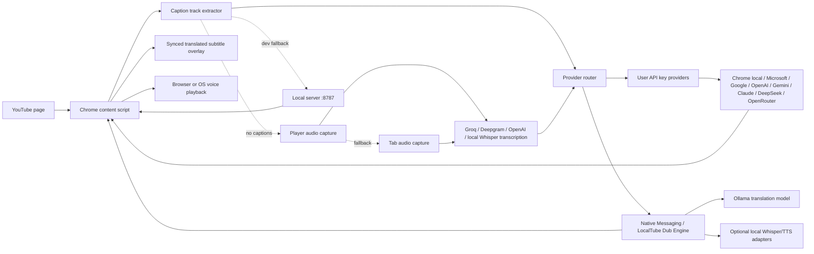

# LocalTube Dub

LocalTube Dub is an open-source Chrome extension for translating and dubbing YouTube videos with Chrome's local Translator, your own AI key, or an optional local Engine.

The project uses original branding, UI, and implementation. It reads YouTube caption tracks when available, translates only when a requested target-language track is unavailable, overlays synchronized subtitles, and can play time-aligned speech.

LocalTube Dub is licensed under Apache-2.0. It has no LocalTube Dub account, subscription, advertising, analytics, or hosted translation backend. See [`docs/privacy-policy.md`](docs/privacy-policy.md), [`SECURITY.md`](SECURITY.md), and [`THIRD_PARTY_NOTICES.md`](THIRD_PARTY_NOTICES.md) before distributing a modified build.

## What works now

- Injects a compact dark translation panel into YouTube watch pages.
- Extracts YouTube caption tracks from the current video, with the target language preferred first.
- Keeps captioned BYOK and Chrome-local sessions usable without the companion Engine: it checks local target/translated/source-caption caches, current live player/watch data, embedded current-video response data, and one same-origin YouTube player API fallback before relying on yt-dlp.
- Uses existing target-language YouTube captions directly for dubbing; the translation API is only used when the target-language subtitle is not available.
- Uses the local Engine caption service (`yt-dlp`) only as the final subtitle extractor when local caches and current-page captions cannot provide readable text.
- Supports free on-device translation with Chrome's built-in desktop Translator API, plus BYOK providers: Microsoft Translator, Google Cloud Translation, OpenAI, Gemini, Claude, DeepSeek, OpenRouter, and custom OpenAI-compatible endpoints.
- Stores API keys in `chrome.storage.local`, not sync storage.
- Installs with host access only to YouTube and the optional localhost Engine. Cloud Provider access is requested later for the exact selected HTTPS origin and is checked again before captions or audio are sent.
- Supports rolling ahead-of-playback transcription for videos without YouTube captions through local yt-dlp plus whisper.cpp, with short player/tab recording as a compatibility fallback.
- In local no-caption mode, can prepare the entire video transcript as one cancellable background task. The Engine downloads only low-bitrate audio, transcribes locally, deletes temporary media, and then translates the complete timeline for full SRT/WebVTT export.
- Supports separate transcription providers: Groq Whisper, Deepgram Nova, or OpenAI Whisper.
- Starts captioned videos after translating the current playback window, then keeps translating later cues in the background.
- Caches readable public source captions immediately and complete target/translated timelines on the user's device. Reopening the same video can skip YouTube extraction, and matching completed Provider/model translations can also skip translation. Target-language tracks supplied by YouTube remain reusable across Provider changes. Entries expire after 7 days and are capped at 12 timeline entries or about 4 MB.
- Keeps the Chrome Native Messaging local Engine path for yt-dlp, Whisper, and local TTS, with Ollama available as an advanced optional translator.
- Automatically starts the local caption Engine once when a real transport-level disconnect is detected, retries the same subtitle request, and keeps rate limits, confirmed no-caption videos, access restrictions, and timeouts out of the restart path.
- Keeps a local HTTP service at `http://127.0.0.1:8787` for development fallback.
- Shows translated subtitles synchronized to playback.
- Exports the translated subtitle timeline as SRT or WebVTT. Captioned videos become a complete export after background translation finishes; rolling no-caption sessions export the currently prepared range as a clearly named partial file.
- Renders any complete translated timeline into a synchronized M4A or WAV track. Users can export pure translated voice, or mix it with the video's complete original audio at the selected original-volume level. Nearby fragmented captions reuse the live semantic voice segments, and up to three local TTS workers render independent segments in parallel before ordered timeline assembly. A completed track can be played directly in the YouTube panel and follows play, pause, playback speed, and seeking before it is downloaded.
- Optional synchronized voice playback. It warms the free local Engine TTS while captions are prepared, prefetches up to six upcoming semantic segments with three bounded workers, and plays generated clips on the video timeline. An uncached clip that is not ready near its subtitle boundary falls back quickly to browser/OS speech synthesis instead of starting late.
- Offers two explicit speech modes: Microsoft Edge neural voices are the first-run default for more natural no-key dubbing, while private macOS system voices remain available for the fastest fully local path. Natural online speech sends only the subtitle text being spoken; selecting `本地系统（快速）` keeps speech generation on the Mac.

## Current limitation

For local no-caption mode, the Engine first asks yt-dlp for a bounded audio window around the current playback position and transcribes it with whisper.cpp. While the video plays, later windows are prepared ahead of the timeline and merged continuously. If Engine window extraction is unavailable, the extension records a short window from the current YouTube player and falls back to Chrome tab audio capture. API transcription through Groq, Deepgram, or OpenAI remains short-window based.

Chrome only allows tab audio recording after the user invokes the extension on the current page. Most videos now use direct player capture and do not need this fallback grant. If the fallback is needed, the user should open the YouTube video page, click the LocalTube Dub toolbar icon once, then return to the page panel and click "开始翻译". Chrome settings pages, extension pages, and background tabs cannot be recorded.

Long no-caption videos can continue through rolling local Engine windows and export the currently prepared range, or use “准备完整字幕” to pre-generate the complete transcript. Full preparation is currently local-only, supports videos up to two hours by default, and can be cancelled. Once any captioned or no-caption timeline is complete, the export selectors can produce either synchronized pure voice or voice mixed with the video's original audio, as a compact M4A or lossless WAV. The ready track can be previewed against the current YouTube timeline; the Engine supports byte-range media loading so seeking does not require downloading the complete file first. Mixed mode downloads audio only and uses the visible “原声大小” value. It does not separate original speech from background sound, and it does not mux a new video file.

## Recommended user setup

Load the extension, open the popup, then:

1. Use the single `免费 / 自带 Key` workflow. The default `Chrome 本地翻译（免费）` does not need a translation API key; Chrome desktop downloads the required language pack on first use. You can instead select a cloud provider and paste your own key.
2. Install/start the companion Engine once so the extension can read YouTube captions through `yt-dlp`. New installations use `Microsoft 自然在线` by default for no-key neural voices; choose `本地系统（快速）` to use macOS `say` without online speech processing. For no-caption videos, the install page can one-click install whisper.cpp, ffmpeg, and a local multilingual model.
3. Pick a target language.
4. Keep “缓存翻译字幕” enabled for faster repeat playback, or disable it when no local caption retention is desired. “清除字幕缓存” removes all cached timelines immediately.
5. Open a YouTube video and click "开始翻译" in the page panel. If the page asks for a tab-audio grant, click the LocalTube Dub toolbar icon once on the current YouTube page and retry.

For videos without captions, configure the "无字幕转写" section in the popup. Translation and transcription are independent: the recommended free combination is `Chrome 本地翻译（免费）` plus `本地 Engine（免费，推荐）` with whisper.cpp. Groq, Deepgram, and OpenAI transcription remain available for users who prefer their own key.

Chrome asks for the optional `tabCapture` and `offscreen` permissions only when “无字幕时自动转写” is enabled. These permissions support the current-tab compatibility recorder; they are not granted at installation and are not needed for captioned videos.

For videos with captions, the extension first checks local target-language, completed Provider, and reusable source-caption caches. On a first visit, it asks the current YouTube page for an already translated target-language track; if that exists, it uses the text directly without calling DeepSeek, Google, Microsoft, or another translation API. A readable source-language page track also starts immediately and is cached locally, then only that text is translated. The Engine requests YouTube's translated or source captions through `yt-dlp` only when the page cannot supply readable captions, and caption extraction does not download video or audio.

When `Chrome 本地翻译（免费）` is selected and no target-language caption exists, translation runs with Chrome's built-in Translator API in the YouTube page. The API is available on desktop Chrome and downloads language packs on demand. Translation remains separate from subtitle extraction and local TTS.

Microsoft Translator and Google Cloud Translation are available in BYOK mode. They still require official API keys and cloud accounts, but their free tiers are often enough for light personal use. Existing target-language captions do not consume translation quota.

Voice playback is separate from translation. The first-run default uses `edge-tts` and sends only each subtitle segment's text to Microsoft's speech service; no API key is required. Selecting the local system mode makes the Engine call the operating system TTS (`say` on macOS) instead. The content script prefetches an 18-second/six-segment window with at most three requests at once and plays each clip on its original timebox. The popup and YouTube panel show only voices matching both the selected speech engine and target language, while retaining automatic matching as the recommended default. Confirmed local or online synthesis failures fall back to Chrome's built-in `speechSynthesis`.

If the user jumps to a new timestamp before the background cache reaches that position, the extension prioritizes translating the new playback window.

Completed translations are cached only after every source cue has a translated cue. Partial rolling transcription is never cached. AI-translated cache keys include the YouTube video ID, target language, translation Provider, and model, so changing any of those inputs cannot reuse an incompatible translation. A target-language track supplied directly by YouTube uses a Provider-neutral key and is checked first, so changing from DeepSeek to Chrome local translation does not force the same Chinese captions through extraction again. Audio, video, and API keys are not part of the timeline cache.

For videos without captions, the extension records the current audio window only. The video may briefly play while recording because the browser needs audio frames; after recording it returns to the original timestamp and pauses for transcription. If the user jumps the video progress while recording or while running from a partial transcript, the current task is cancelled and the user can start again from the new time.

Direct no-caption player recording starts from the current YouTube video element. If the extension must fall back to tab audio and Chrome does not grant tab-audio permission for the current YouTube page, the extension should show the permission message without starting fallback recording.

Stopping or jumping during no-caption recording cancels both the offscreen recorder and any in-flight transcription request.

For custom OpenAI-compatible services, choose "自定义 OpenAI-compatible" and enter the chat completions endpoint, for example:

```text
https://your-gateway.example.com/v1/chat/completions
```

## Local Engine development setup

Load the extension first, then install the Native Messaging host for the extension ID shown in `chrome://extensions`.

```bash
cd /path/to/localtube-dub/companion
./install_native_host_macos.sh YOUR_EXTENSION_ID
```

Smoke test the companion Engine:

```bash
../.venv/bin/python native_host.py --health
../.venv/bin/python native_host.py --demo
```

The default one-click local mode uses Chrome's on-device Translator with the local Engine, so it does not require Ollama. To use Ollama as an advanced fully local translator, run it locally and pull a translation-capable model:

```bash
ollama pull qwen2.5:7b-instruct
```

For local caption extraction, install `yt-dlp` so the Engine can read YouTube subtitles quickly. Current yt-dlp releases require Python 3.10 or newer. The macOS dependency script detects an old system Python, installs a current Homebrew Python when Homebrew is available, creates a private `.venv`, and records that exact Python for Chrome's Native Host. This prevents a reboot from silently returning to Apple's Python 3.9 and an outdated yt-dlp. The installer also adds `curl_cffi`; when available, the Engine lets `yt-dlp` impersonate Chrome's network fingerprint, which reduces YouTube bot/SSL failures on some macOS Python installs. The install page has copy buttons for these commands:

```bash
./scripts/install_engine_deps_macos.sh
./scripts/start_engine_macos.sh
```

The popup and the in-page YouTube panel both show a live Engine indicator:
- green: Engine is running and `yt-dlp` is ready;
- yellow: Engine is running but `yt-dlp` is missing;
- red: Engine is not reachable; use the in-page "启动" button if Native Host is installed, or open the install/start guide.

Health also carries the Engine release and protocol versions. An old Engine that merely answers on port 8787 is shown as requiring an update instead of green. A version mismatch with a compatible protocol remains usable and is shown as a warning. Reinstall the matching Engine package to update code; restarting an old Engine only restarts the same files.

On macOS, registering the Native Host also installs a self-contained runtime at `~/Library/Application Support/LocalTube Dub/engine-runtime` plus a user LaunchAgent. Engine then starts automatically after login and is restarted by macOS after an unexpected exit, so normal use does not require keeping a Terminal window open. The runtime location avoids macOS background-access restrictions on development projects stored in `~/Documents`. The install guide's “修复开机自启” button can reinstall this service. Persistent service logs are written to `~/Library/Logs/LocalTube Dub`. To install or remove it manually:

```bash
./scripts/install_engine_autostart_macos.sh
./scripts/uninstall_engine_autostart_macos.sh
```

Set `LOCAL_DUB_YTDLP_COMMAND` if `yt-dlp` is installed in a non-standard path. For no-caption local transcription, whisper.cpp is preferred when `whisper-cli`, ffmpeg, and the local model are present. The OpenAI Whisper CLI remains supported as a fallback, and `LOCAL_DUB_WHISPER_COMMAND` can point to another compatible command template. The default model label is `base`; override it with `LOCAL_DUB_WHISPER_MODEL`.

On macOS, the recommended no-caption setup is:

```bash
./scripts/install_local_whisper_macos.sh
```

This installs whisper.cpp and ffmpeg with Homebrew, then downloads the multilingual `base` model to `~/Library/Application Support/LocalTube Dub/models/ggml-base.bin`. The Engine converts the captured browser audio to 16 kHz mono WAV, runs `whisper-cli`, and maps its JSON timestamps back onto the current YouTube position. Override the binary or model with `LOCAL_DUB_WHISPER_CPP_COMMAND` and `LOCAL_DUB_WHISPER_CPP_MODEL`.

For speed, the extension reuses local target, translated, or source-caption caches before making a YouTube request. A first current-page lookup tries at most two target-language tracks and one source track, with raw, JSON3, and WebVTT candidates only; any readable result avoids yt-dlp. If needed, the Engine tries `yt-dlp` without browser cookies, prefers real target-language subtitles, then asks YouTube for its built-in translated subtitle URL before falling back to source-language captions. Caption metadata, direct subtitle URLs, cookie retry, and subtitle-file fallback share one bounded time budget (22 seconds by default), so the extension can finish its subtitle decision within about 30 seconds. When `curl_cffi` is installed, `LOCAL_DUB_YTDLP_IMPERSONATE=auto` adds Chrome impersonation automatically. It retries with Chrome cookies when YouTube asks for login or bot checks. If YouTube returns `429 Too Many Requests`, the extension resumes normal video playback, waits for the reported cooldown, and retries once instead of repeatedly contacting YouTube. If cookie reading fails, close Chrome and restart the Engine, or disable cookie loading with:

```bash
LOCAL_DUB_YTDLP_COOKIES_FROM_BROWSER=none ./.venv/bin/python server/local_dub_server.py
```

If the page panel says `Extension context invalidated`, Chrome is still running an old content script after the extension was reloaded or updated. Refresh the current YouTube video page once, then click "开始翻译" again.

When testing development changes, the in-page panel version must match `extension/manifest.json`. If the YouTube page still shows an older version, click "重新加载" for LocalTube Dub on `chrome://extensions`, then refresh the YouTube video tab. Chrome does not replace already-injected content scripts until the page is refreshed.

The Chrome Web Store version can ship this companion Engine as an optional signed macOS/Windows installer so users who want fully local AI do not need terminal commands. After the Native Host is installed, the extension can one-click start the local HTTP Engine and one-click restart it after upgrades.

## HTTP fallback for debugging

From this folder:

```bash
./scripts/start_engine_macos.sh
```

The server starts on:

```text
http://127.0.0.1:8787
```

If Ollama is selected but not running, the Engine returns an explicit error. It never presents the original-language captions as a successful translation.

On macOS, local voice generation measures the real `say` WAV duration. When a clip is longer than its original subtitle segment, the Engine uses ffmpeg `atempo` (up to 3x for live clips and 4.5x for complete-track rendering) to fit it while preserving pitch; browser playback rate then handles only remaining startup drift. Complete-track mixed mode attenuates the full original audio stream before combining it with the synchronized voice track, so original dialogue remains audible unless the original-volume control is set to zero.

## Load the extension in Chrome

1. Open `chrome://extensions`.
2. Enable Developer mode.
3. Click "Load unpacked".
4. Select:

```text
/path/to/localtube-dub/extension
```

Then open a YouTube video with captions and click the LocalTube Dub panel.

To test no-caption videos:

1. Save a transcription API key in the popup, such as Groq Whisper or Deepgram Nova, or choose local Engine mode with local Whisper installed.
2. Click "开始翻译" in the injected page panel.
3. With local Engine transcription, the first audio window is downloaded and transcribed without playing the video, and later windows are prepared ahead of playback. With an API transcription provider or when Engine extraction fails, the video may play briefly while the extension records the current audio window.
4. If direct player recording is unavailable and the toolbar grant is missing, fallback tab recording should not start; the panel should ask the user to grant the current YouTube page first.

## Developer verification

The current architecture audit, historical regression rules, and known release gaps are recorded in [`docs/development-audit.md`](docs/development-audit.md). Read and update it before changing a core caption, transcription, TTS, Engine, or packaging workflow.

Run these checks after editing the extension or Engine:

```bash
node tools/verify_extension_flows.js
node tools/verify_provider_registry.js
node --check extension/content.js
node --check extension/background.js
node --check extension/popup.js
PYTHONPYCACHEPREFIX=/private/tmp/localtube-pycache python3 tools/verify_local_engine.py
PYTHONPYCACHEPREFIX=/private/tmp/localtube-pycache python3 -m py_compile server/local_dub_server.py companion/native_host.py
```

## Local AI architecture



## Publishing notes

- Build versioned private-beta artifacts with `./scripts/build_release_macos.sh FINAL_CHROME_EXTENSION_ID`; the script produces and validates the Web Store extension ZIP, macOS Engine ZIP, and SHA-256 list.
- Add `LOCAL_DUB_ENGINE_DOWNLOAD_URL=https://...` and `LOCAL_DUB_SUPPORT_URL=https://...` when building a hosted customer release. The customer install view receives those links at build time and hides source checkout paths, Terminal commands, and development diagnostics.
- BYOK mode can work without a companion installer.
- The current optional macOS Engine ZIP has double-click install, no-caption Whisper install, and uninstall commands, but it is explicitly unsigned and unnotarized. Public distribution still requires a signed/notarized app or installer.
- The popup exposes one customer-facing workflow: free Chrome translation or the user's own API key, with the companion Engine configured separately where needed.
- The installer must write the final Chrome Web Store extension ID into the Native Messaging `allowed_origins` list.
- The privacy policy must disclose that captions are sent to the user's selected third-party AI provider when API mode is used.
- The privacy policy must disclose that no-caption mode records current video or tab audio and sends it to the user's selected transcription path when enabled by the user.
- Draft launch docs are in `docs/`.
- The exact build, customer flow, and public release gates are in [`docs/release-process.md`](docs/release-process.md).
- Chrome Web Store permission text is maintained in [`docs/chrome-web-store-permissions.md`](docs/chrome-web-store-permissions.md).
- The public privacy policy source is [`docs/privacy-policy.md`](docs/privacy-policy.md); its hosted HTTPS URL must be entered in the Web Store dashboard.
- The draft single-purpose description, customer copy, listing assets, and reviewer instructions are maintained in [`docs/store-listing-draft.md`](docs/store-listing-draft.md).
- Release ZIP files and checksums belong in versioned repository releases; `dist/` is intentionally excluded from source control.

## Suggested next upgrades

- Sign and notarize the macOS Engine bootstrap, then host it with its checksum on a stable HTTPS support page.
- Add a reliable signed Windows Native Messaging/Engine installer.
- Add a production-quality local TTS adapter such as Piper, ChatTTS, GPT-SoVITS, or Fish Speech.
- Add voice cloning only when you have permission to use the speaker's voice.

## Contributing and license

Contributions are welcome under the process in [`CONTRIBUTING.md`](CONTRIBUTING.md). Support requests belong in the public issue tracker; security-sensitive reports use the private process in [`SECURITY.md`](SECURITY.md).

Source code is available under the [Apache License 2.0](LICENSE). Third-party tools, models, platforms, and services retain their own licenses and terms.

LocalTube Dub is not affiliated with, sponsored by, or endorsed by Google, YouTube, Microsoft, or any supported AI Provider. Users are responsible for following applicable platform terms, copyright rules, voice-consent requirements, and local law.
